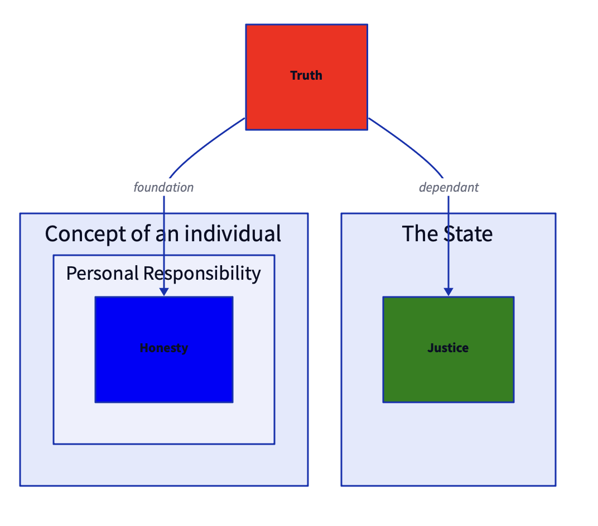

# Dictim.graph

dictim.graph is a small library to convert a Clojure representation of a graph into [dictim](https://github.com/judepayne/dictim) and then onward to be visualized via [d2](https://github.com/terrastruct/d2).

The `dictim.graph.core` namespace exposes one public function `graph->dictim`. This function has similar semantics to [rhizome](https://github.com/ztellman/rhizome), Zac Tellman's influential library for visualising clojure graphs via Graphviz.


## Release Information

Latest release:

[deps.edn](https://clojure.org/reference/deps_and_cli) dependency information:

As a git dep:

```clojure
io.github.judepayne/graphdict {:git/tag "0.1.0" :git/sha ""}
``` 

## Usage

`graph->dictim` takes two parameters, `nodes` - the vertices in your graph and `edges` in the same graph.

These can be followed by a map of zero or more keyword arguments:

| name |required? |description |
|------|----------|-------------|
| `:node->key` | optional |dictim (and d2) require nodes (or shapes/ containers in d2 speak) to have keys. This function takes a node and should return its key. If not specified, defaults to `identity` i.e. the node should be its key. |
| `:node->attrs` | optional | takes a node and returns a map of d2 rendering attributes to be applied to the node |
| `:edge->src-key` | optional | takes an edge and returns the key of the source node. If not specified, `:src` and `first` are attempted on the edge. |
| `:edge->dest-key` | optional | takes an edge and returns the key of the destination node. If not specified, `:dest` and `first` are attempted on the edge. |
| `:edge->attrs` | optional |takes an edge and returns a map of d2 rendering attributes |
| `:node->cluster` | optional |takes a node and returns the cluster (key) if any that the node belongs to. In d2 speak a cluster is a container |
| `:cluster->parent` | optional |takes a cluster (key) and returns which cluster (key), if any, it is contained within |
| `:cluster->attrs` | optional | takes a cluster and returns a map of d2 attributes onto values describing how the cluster should be rendered. |

`nodes` can be anything but `nodes`, `node->key`, `edges`, `edge->src-key` and `edge->dest-key` must all marry up. e.g. If you choose to pass nodes as (just) a collection of keywords, leaving the `node->key` function to default to `identity` is fine. In this scenario if edges are of the form `[:a :b`] where :a and :b are in the set of nodes or `{:src :a :dest :b}` then you can ommit specifying `edge->src-key` and `edge->dest-key` as well, since the defaults will be fine.

Example:

````Clojure
user> (use 'dictim.graph.core)
nil
user> (def nodes '({:id :truth :lbl "Truth" :fill "red" :cluster nil} {:id :honesty :lbl "Honesty" :fill "blue" :cluster :personal} {:id :justice :lbl "Justice" :fill "green" :cluster :state}))
#'user/nodes
user> (def edges '({:src :truth :dest :honesty :directed? false :label "foundation"} {:src :truth :dest :justice :label "dependant" :stroke "green"}))
#'user/edges
user> (graph->dictim nodes
                     edges
                     {:node->key :id
                     :node->attrs (fn [n] {:label (:lbl n) :style.fill (:fill n)})
                     :edge->src-key :src
                     :edge->dest-key :dest
                     :edge->attrs (fn [e] {:label (:label e)
                                           :directed? (:directed? e)})
                     :node->cluster :cluster
                     :cluster->parent {:personal :individual}
                     :cluster->attrs {:personal {:label "Personal Responsibility"}
                                      :state {:label "The State"}
                                      :individual {:label "Concept of an individual"}}})
=>
([:individual
  "Concept of an individual"
  [:personal
   "Personal Responsibility"
   [:honesty "Honesty" {:style.fill "blue"}]]]
 [:state "The State" [:justice "Justice" {:style.fill "green"}]]
 [:truth "Truth" {:style.fill "red"}]
 [:truth "->" :individual.personal.honesty "foundation"]
 [:truth "->" :state.justice "dependant"])

````

The output is [dictim](https://github.com/judepayne/dictim) format. You can use the dictim library to convert dictim to d2 and then visualize it:



## License

Copyright © 2023 Jude Payne

Distributed under the [MIT License](http://opensource.org/licenses/MIT)

